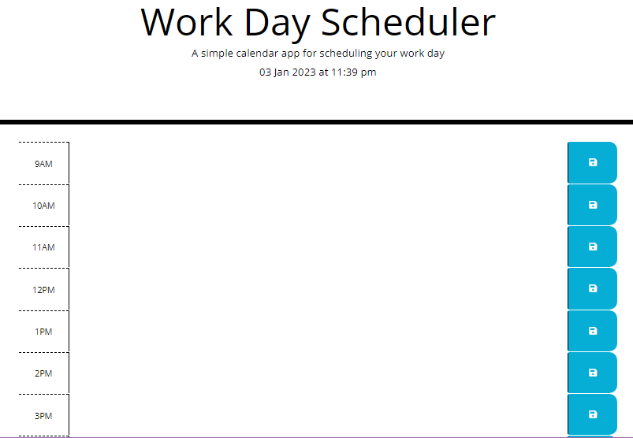

# Work Day Scheduler

 This is a calendar application that allows a user to save events for each hour of the day via an input field.

## Function

The app will:

* Display the current day at the top of the calender when a user opens the planner.
* Present timeblocks for standard business hours when the user scrolls down.
* Color-code each timeblock based on past, present, and future when the timeblock is viewed.
* Allow a user to enter an event when they click a timeblock
* Save the event in local storage when the save button is clicked in that timeblock.
* Persist events between refreshes of a page

Here is a demo of the application functionality:

Progress

Work day scheduler field created with current time display.

© 2022 edX Boot Camps LLC. Confidential and Proprietary. All Rights Reserved.
